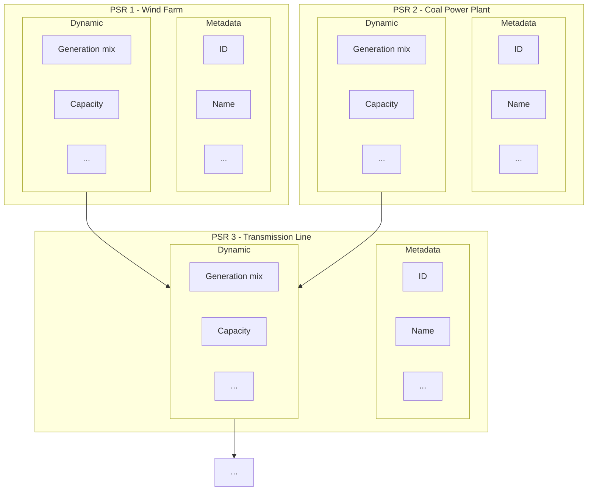

# _CDSC-WG2-01 - Topology and Data Types_ 

Version: _0.0.1_

Status: Pre-Draft
 
© _________________

This specification is subject to the Community Specification License 1.0, available at [https://github.com/CommunitySpecification/1.0](https://github.com/CommunitySpecification/1.0).

## Contents <a id="table-of-contents" href="#table-of-contents" class="permalink">🔗</a>
* [1. Foreword](#foreword)  
* [2. Introduction](#introduction)  
* [2. Terms and Definitions](#terms-and-definitions)  
* [3.  Topology](#topology)  
* [4.  Entities](#entities)  

## Foreword <a id="foreword" href="#foreword" class="permalink">🔗</a>

Attention is drawn to the possibility that some of the elements of this document may be the subject of patent rights. No party shall not be held responsible for identifying any or all such patent rights.

Any trade name used in this document is information given for the convenience of users and does not constitute an endorsement.

This document was prepared by [Insert name of group].

This second/third/… edition cancels and replaces the first/second/… edition (#####:####), which has been technically revised.
The main changes compared to the previous edition are as follows:
—	xxx xxxxxxx xxx xxxx

Known patent licensing exclusions are available in the specification’s repository’s Notices.md file.

Any feedback or questions on this document should be directed to specifications repository, located at _________________.

THESE MATERIALS ARE PROVIDED “AS IS.” The Contributors and Licensees expressly disclaim any warranties (express, implied, or otherwise), including implied warranties of merchantability, non-infringement, fitness for a particular purpose, or title, related to the materials.  The entire risk as to implementing or otherwise using the materials is assumed by the implementer and user. IN NO EVENT WILL THE CONTRIBUTORS OR LICENSEES BE LIABLE TO ANY OTHER PARTY FOR LOST PROFITS OR ANY FORM OF INDIRECT, SPECIAL, INCIDENTAL, OR CONSEQUENTIAL DAMAGES OF ANY CHARACTER FROM ANY CAUSES OF ACTION OF ANY KIND WITH RESPECT TO THIS DELIVERABLE OR ITS GOVERNING AGREEMENT, WHETHER BASED ON BREACH OF CONTRACT, TORT (INCLUDING NEGLIGENCE), OR OTHERWISE, AND WHETHER OR NOT THE OTHER MEMBER HAS BEEN ADVISED OF THE POSSIBILITY OF SUCH DAMAGE.

## Introduction <a id="introduction" href="#introduction" class="permalink">🔗</a>
This specification was developed as part of the global effort to combat the climate crisis. Specifically, in order to scalably measure carbon emissions of organizations and calculate the impact of deploying and operating clean energy technologies, companies need an efficient means to discover the details and capabilities of energy utilities and other similar entities.

This specification offers a topological graph model of electricity grids that has been defined by this working group, which is to be used for subsequent specifications. This specification is intended to be a starting point for defining the necessary terms of structure for developing a data streaming specification.
 
 
###	Normative references

The following documents are referred to in the text in such a way that some or all of their content constitutes requirements of this document. For dated references, only the edition cited applies. For undated references, the latest edition of the referenced document (including any amendments) applies.

- IEC 62325-351: CIM European market model exchange profile

## 2. Terms and definitions <a id="terms-and-definitions" href="#terms-and-definitions" class="permalink">🔗</a>

For the purposes of this document, the following terms and definitions apply.

ISO and IEC maintain terminological databases for use in standardization at the following addresses:

- 	ISO Online browsing platform: available at https://www.iso.org/obp
- 	IEC Electropedia: available at http://www.electropedia.org/

This specification was informed through conversations with multiple Transmission System Operators as well as consulting IEC 62325-351. The following terms will be specifically used:

- <b>PowerSystemResource</b>: A power system resource (PSR) can be an item of equipment such as a switch, an equipment container containing many individual items of equipment such as a substation, or an organisational entity such as sub-control area. Power system resources can have measurements associated.
- ...

### 3. Topology<a id="topology" href="#topology" class="permalink">🔗</a>

### Topology Relationship
We envision that any electric power grid can be described as a directed graph where nodes are different components of the power system elements and edges are connections between them.

To describe a power system topology we therefore need to enumerate the possible nodes, and edges, as well as their definitions.

### Granularity Levels

We might not want to strictly define specific named levels in the hierarchy, since each grid might be structured slightly differently. There can be a different number of levels for each region, but we should make sure that equivalent structures in each region use the same level numbers (this may mean that in some regions, certain levels are skipped).

|Level|US Grid|European Grid|CIM|Definition|
|--|--|--|--|--|
|0|Interconnect|Synchronous area|GeographicalRegion |
|1|Balancing Area|LFC block/LFC area|| |
|2|Trading Hub / Transmission-congested zone|Bidding zone|SubGeographicalRegion | |
|3|Transmission Node/Substation|Control area|Substation | |
|4|Distribution Node/Substation or Power Plant|Scheduling Area/Sub scheduling area|Feeder| |
|5|Meter (Generator or Load)|Metering Grid Area|ACDCTerminal | |

### Graph Edges
|Level or Inter-level|Description|Type|Data|
|--|--|--|--|--|
|0|Between Interconnects|Physical: DC transmission lines|Line capacity, etc| |
|0-1|Balancing Area to Interconnect Mapping|Virtual|Mapping table| |
|1|Between Balancing Areas|Physical: Transmission lines | | |
|1-2|Hubs to BAs|Virtual|Mapping table| |
|2|Between Trading Hubs / Transmission-congested zones|Physical: Transmission lines | | |
|2-3|Transmission Substation to Hub|Virtual|Mapping table| |
|3|Between Transmission Nodes/Substation|Physical: Transmission lines | | |
|3-4|Distribution Substations/Plants to Transmission Nodes|Physical: subtransmission lines||Line |
|4|Between Distribution Node/Substation or Power Plant|N/A? | | |
|4-5|Meters to substations/plants|Physical: distribution lines|| |
|5|Between Meters (Generator or Load)|N/A?| | |

### 4. Entities<a id="entities" href="#tentities" class="permalink">🔗</a>

We propose to define data types for three different kinds of entities. These entities would all be defined as nodes in the [topology graph](#terms-and-definitions--topology). The three kinds of entities are:

* System. A system is the lowest granularity level in the topology graph. It is a collection of other entities. A system can for example be a single synchronous grid, or a collection of synchronous grids.
* Market. A market is a collection of nodes that are connected to each other through a single market operator. A market can for example be a single balancing area, or a collection of balancing areas.
* Unit. A unit is a single physical entity. A unit can for example be a single power plant, or a single generation unit within that plant.

### System

| Data Type                           | Data definition                                                          | Unit / Data Format | Temporal Granularity          | Secondary Information                        | Locational Granularity | Time horizon        | Latency   | Maximum Latency | Requirement level |
|-------------------------------------|--------------------------------------------------------------------------|--------------------|-------------------------------|----------------------------------------------|------------------------|---------------------|-----------|-----------------|-------------------|
| Generation                          | Net generation output per time unit                                      | MW (Float)         | Market (hourly or sub hourly) | Locational Granularity                       | Balancing Region       | Real-time           | Real-time | Day +7          | Must-have         |
| Demand                              | Total system demand                                                      | MW (Float)         | Market (hourly or sub hourly) | Locational Granularity                       | Balancing Region       | Real-time           | Real-time | Day +7          | Must-have         |
| Total Emissions (by pollutant type) | Total operating (direct) emissions over time period                      | t (metric) (Float) | Market (hourly or sub hourly) | Locational Granularity, Pollutant type       | Balancing Region       | Real-time           | Real-time | Day +7          | Should-have       |
| Imports                             | Imports by interconnect                                                  | MW (Float)         | Market (hourly or sub hourly) | Locational Granularity                       | Balancing Region       | Real-time           | Real-time | Day +7          | Must-have         |
| Exports                             | Exports by interconnect                                                  | MW (Float)         | Market (hourly or sub hourly) | Locational Granularity                       | Balancing Region       | Real-time           | Real-time | Day +7          | Must-have         |
| Renewable generation curtailment    | Curtailment of renewable generation                                      | MW (Float)         | Market (hourly or sub hourly) | Locational Granularity, fuel type (optional) | Balancing Region       | Real-time           | Real-time | Day +7          | Should-have       |
| Generation by fuel type             | The full breakdown of generation per fuel type (e.g. wind, solar)        | MW (Float)         | Market (hourly or sub hourly) | Fuel Type List                               | Balancing Region       | Real-time           | Real-time | Day +7          | Must-have         |
| Demand Forecast                     | Forecast of system demand over the next day                              | MW (Float)         | Market (hourly or sub hourly) | Locational Granularity                       | Balancing Region       | Short-term forecast | Day-ahead | N/A             | Should-have       |
| Generation Forecast                 | Forecast of system generation by fuel type over the next day             | MW (Float)         | Market (hourly or sub hourly) | Fuel Type List, generation technology        | Balancing Region       | Short-term forecast | Day-ahead | N/A             | Should-have       |
| Curtailment Forecast                | Forecast of renewable generation curtailment                             | MW (Float)         | Market (hourly or sub hourly) | Fuel Type List, generation technology        | Balancing Region       | Short-term forecast | Day-ahead | N/A             | May-have          |
| Installed Capacity                  | Max output of technology type                                            | MW (Float)         | Annual                        | Fuel Type List                               | Balancing Region       | Historical          | Day +30   | Day +90         | Must-have         |
| Generation type emissions intensity | Direct Emission factors per production mode level                        | tCO2/MWh (Float)   | Annual                        | Fuel Type List                               | Balancing Region       | Historical          | Day +30   | Day +90         | Should-have       |
| Fuel emissions rates                | Direct Emissions associated with a fixed volume of consumption of a fuel | tCO2/BTU (Float)   | Annual                        | Fuel Type List                               | Balancing Region       | Historical          | Day +30   | Day +90         | Should-have       |

### Market

| Data Type                                                    | Data definition                                                                    | Unit / Data Format   | Temporal Granularity          | Secondary Information  | Locational Granularity | Time horizon | Latency   | Maximum Latency | Requirement level |
|--------------------------------------------------------------|------------------------------------------------------------------------------------|----------------------|-------------------------------|------------------------|------------------------|--------------|-----------|-----------------|-------------------|
| REAL TIME market price Locational Marginal Prices/ Balancing | LMP set by system operator at each node on the grid (assuming nodal market design) | Currency/MWh (Float) | Market (hourly or sub hourly) | Locational Granularity | Zonal / nodal          | Real-time    | Real-time | N/A             | Should-have       |
| Locational Marginal Congestion Prices                        | The impact of congestion on LMP                                                    | Currency/MWh (Float) | Market (hourly or sub hourly) | Locational Granularity | Zonal / nodal          | Historical   | Day +?    | N/A             | Should-have       |
| Day ahead price                                              | Day ahead prices set by market operator per market zone, by hour                   | Currency/MWh         | Market (hourly or sub hourly) | Locational granularity | Zonal / nodal          | Day ahead    |           |                 | Must-have         |

### Unit

| Data Type                          | Data definition                                                                                                                    | Unit / Data Format                       | Temporal Granularity          | Secondary Information   | Locational Granularity | Time horizon | Latency | Maximum Latency | Requirement level |
|------------------------------------|------------------------------------------------------------------------------------------------------------------------------------|------------------------------------------|-------------------------------|-------------------------|------------------------|--------------|---------|-----------------|-------------------|
| Unit Generation                    | Generation for each unit in each time interval                                                                                     | MWh (Float)                              | Market (hourly or sub hourly) | Unit ID                 | unit                   | Historical   | Day +30 | Day + 90        | Should-have       |
| Unit Emissions (by pollutant type) | Direct emissions from combustion of fuel                                                                                           | t (Float)                                | Market (hourly or sub hourly) | Unit ID, Pollutant type | unit                   | Historical   | Day +30 | Day + 90        | Should-have       |
| Installed Capacity                 | Max output of plant                                                                                                                | MW (Float)                               | Monthly                       | Unit ID                 | unit                   | Historical   | Annual  | Year + 1        | Must-have         |
| Unit Heat Rates                    | The amount of energy used by an electrical generator/power plant to generate one kWh of electricity                                | J/kWh (Float)                            | Monthly                       | Unit ID                 | unit                   | Historical   | Annual  | Year + 1        | Should-have       |
| Heat Rates Curves                  | The amount of energy used by an electrical generator/power plant to generate one kWh of electricity at different generation levels | J/kWh (Float)                            | Monthly                       | Unit ID                 | unit                   | Historical   | Annual  | Year + 1        | May-have          |
| Unit fuel types                    | Fuel consumed by each unit                                                                                                         | List of types (List[String])             | Annual                        | Unit ID                 | unit                   | Historical   | Annual  | Year + 1        | Must-have         |
| Unit Location                      |                                                                                                                                    | Lat,Long (Cf Google Maps) (Tuple[Float]) | Annual                        | Unit ID                 | unit                   | Historical   | Annual  | Year + 1        | Should-have       |
| Unit Type                          |                                                                                                                                    | Generation Technology (String)           | Annual                        | Unit ID                 | unit                   | Historical   | Annual  | Year + 1        | Should-have       |
| Unit market                        | Energy market of the unit                                                                                                          | (Integer)                                | Monthly                       | Unit ID                 | unit                   | Historical   | Annual  | Year + 1        | May-have          |
| Unit owner information             |                                                                                                                                    | (String)                                 | Annual                        | Unit ID                 | unit                   | Historical   | Annual  | Year + 1        | May-have          |
| Unit ID number                     |                                                                                                                                    | (Integer)                                | Annual                        | Unit ID                 | unit                   | Historical   | Annual  | Year + 1        | Should-have       |
| Unit name                          |                                                                                                                                    | (String)                                 | Annual                        | Unit ID                 | unit                   | Historical   | Annual  | Year + 1        | May-have          |
| Unit start year                    |                                                                                                                                    | (Integer)                                | Annual                        | Unit ID                 | unit                   | Historical   | Annual  | Year + 1        | Should-have       |
| Co-generation Heat Output          | Total Heat produced in the cogeneration heation                                                                                    | J (Float)                                | Annual                        | Unit ID                 | unit                   | Historical   | Annual  | Year + 1        | May-have          |

### Other Entities 

Some data types are defined for multiple variables. For example, emissions can be reported for multiple pollutants, or production can be reported for multiple fuel types.

In these cases, the data type is defined once, and we specify henceforth that the data type is a variable. The variables are defined as follows:

| Fuel type                   |
|-----------------------------|
| Brown coal/Lignite          |
| Hard coal                   |
| Coal-derived gas            |
| Other coal                  |
| Natural gas                 |
| Landfill gas                |
| Other gas                   |
| Wood / Wood waste           |
| Municipal waste             |
| Propane oil                 |
| Shale oil                   |
| Distillate oil              |
| Other oil                   |
| Peat                        |
| Uranium, Thorium, Plutonium |
| Solar                       |
| Wind                        |
| Geothermal                  |
| Water                       |
| Other                       |

| Generation technology                        |
|----------------------------------------------|
| Energy Storage, Battery                      |
| Energy Storage, Compressed Air               |
| Energy Storage, Concentrated Solar Power     |
| Energy Storage, Flywheel                     |
| Energy Storage, Reversible Hydraulic Turbine |
| Energy Storage, Other                        |
| Fuel Cell                                    |
| Turbine, Binary Cycle                        |
| Turbine, Combined-Cycle                      |
| Turbine, Steam                               |
| Turbine, Gas Combustion                      |
| Hydrokinetic, Axial Flow Turbine             |
| Hydrokinetic, Wave Buoy                      |
| Hydrokinectic, Other                         |
| Hydraulic Turbine                            |
| Internal Combustion                          |
| Other                                        |
| Photovoltaic                                 |
| Wind Turbine, Onshore                        |
| Wind Turbine, Offshore                       |

| Generator Aggregation |
|-----------------------|
| Generator             |
| Plant                 |
| Unit                  |
| Boilers               |

| Pollutant type |
|----------------|
| NOx            |
| SOx            |
| CO2            |
| Particulates   |

