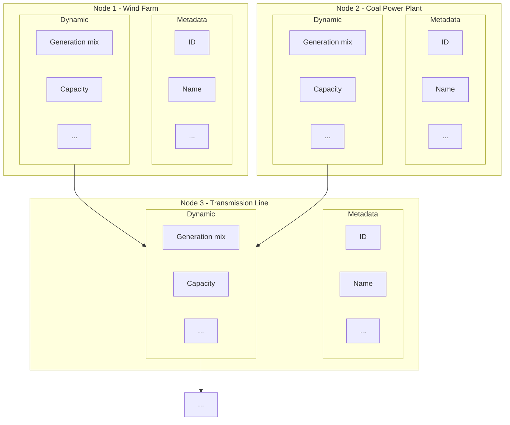

# _CDSC-WG2-01 - Topology_ 

Version: _0.0.1_

Status: Draft
 
© _________________

This specification is subject to the Community Specification License 1.0, available at [https://github.com/CommunitySpecification/1.0](https://github.com/CommunitySpecification/1.0).

## Contents <a id="table-of-contents" href="#table-of-contents" class="permalink">🔗</a>
* [1. Foreword](#foreword)  
* [2. Introduction](#introduction)  
* [3. Terms and Definitions](#terms-and-definitions)  
* [4.  Topology](#topology)  
  * [4.1  Topology Relationship](#topology--relationship)  
  * [4.2  Granularity Levels](#topology--granularity-levels) 
  * [4.2  Graph Edges](#topology--graph-edges) 

## 1. Foreword <a id="foreword" href="#foreword" class="permalink">🔗</a>

Attention is drawn to the possibility that some of the elements of this document may be the subject of patent rights. No party shall not be held responsible for identifying any or all such patent rights.

Any trade name used in this document is information given for the convenience of users and does not constitute an endorsement.

This document was prepared by the Carbon Data Specification Working Group 2 - Power Systems Data.

Known patent licensing exclusions are available in the specification’s repository’s Notices.md file.

THESE MATERIALS ARE PROVIDED “AS IS.” The Contributors and Licensees expressly disclaim any warranties (express, implied, or otherwise), including implied warranties of merchantability, non-infringement, fitness for a particular purpose, or title, related to the materials.  The entire risk as to implementing or otherwise using the materials is assumed by the implementer and user. IN NO EVENT WILL THE CONTRIBUTORS OR LICENSEES BE LIABLE TO ANY OTHER PARTY FOR LOST PROFITS OR ANY FORM OF INDIRECT, SPECIAL, INCIDENTAL, OR CONSEQUENTIAL DAMAGES OF ANY CHARACTER FROM ANY CAUSES OF ACTION OF ANY KIND WITH RESPECT TO THIS DELIVERABLE OR ITS GOVERNING AGREEMENT, WHETHER BASED ON BREACH OF CONTRACT, TORT (INCLUDING NEGLIGENCE), OR OTHERWISE, AND WHETHER OR NOT THE OTHER MEMBER HAS BEEN ADVISED OF THE POSSIBILITY OF SUCH DAMAGE.

## 1. Introduction <a id="introduction" href="#introduction" class="permalink">🔗</a>
This specification was developed as part of the global effort to combat the climate crisis. Specifically, in order to scalably measure carbon emissions of organizations and calculate the impact of deploying and operating clean energy technologies, companies need an efficient means to discover the details and capabilities of energy utilities and other similar entities.

This specification offers a topological graph model of electricity grids that has been defined by this working group, which is to be used for subsequent specifications. This specification is intended to be a starting point for defining the necessary terms of structure for developing a data streaming specification.

###	Normative references

The following documents are referred to in the text in such a way that some or all of their content constitutes requirements of this document. For dated references, only the edition cited applies. For undated references, the latest edition of the referenced document (including any amendments) applies.

- IEC 61968/61970: Common Information Model 
- [Glossary of Terms Used in NERC Reliability Standards 2023](https://www.nerc.com/pa/Stand/Glossary%20of%20Terms/Glossary_of_Terms.pdf)
- [Glossary of Terms Used by PJM](https://www.pjm.com/Glossary)
- [EBIX Harmonised Role Model 2022-01](https://mwgstorage1.blob.core.windows.net/public/Ebix/Harmonised_Role_Model_2022-01.pdf)
## 2. Terms and definitions <a id="terms-and-definitions" href="#terms-and-definitions" class="permalink">🔗</a>

For the purposes of this document, the following terms and definitions apply.

ISO and IEC maintain terminological databases for use in standardization at the following addresses:

- 	ISO Online browsing platform: available at https://www.iso.org/obp
- 	IEC Electropedia: available at http://www.electropedia.org/

This specification was informed through conversations with multiple Transmission System Operators as well as consulting IEC-61968 and IEC-61970 and the NERC Glossary of Terms. The following terms will be specifically used (definitions taken from the standard).

### CIM
- <b>PowerSystemResource</b>: A power system resource (PSR) can be an item of equipment such as a switch, an equipment container containing many individual items of equipment such as a substation, or an organisational entity such as sub-control area. Power system resources can have measurements associated.
- <b>GeographicalRegion</b>: A geographical region of a power system network model.
- <b>SubGeographicalRegion</b>: A subset of a geographical region of a power system network model.
- <b>Substation</b>: A collection of equipment for purposes other than generation or utilization, through which electric energy in bulk is passed for the purposes of switching or modifying its characteristics.
- <b>Feeder</b>:A collection of equipment for organizational purposes, used for grouping distribution resources. The organization a feeder does not necessarily reflect connectivity or current operation state.
- <b>GeneratingUnit</b>: A single or set of synchronous machines for converting mechanical power into alternating-current power. For example, individual machines within a set may be defined for scheduling purposes while a single control signal is derived for the set. In this case there would be a GeneratingUnit for each member of the set and an additional GeneratingUnit corresponding to the set.

***
### Europe
#### EBIX Harmonised Role Model
- <b>Synchronous Area</b>:An area covered by synchronously interconnected LFC  blocks (Examples of Synchronous Areas are Continental Europe,  Great Britain, Ireland-Northern Ireland, Nordic and the  power systems of Lithuania, Latvia and Estonia, together  referred to as ‘Baltic’ which are part of a wider synchronous area (IPS/UPS))
- <b>LFC Block</b>:A part of a synchronous area or an entire synchronous  area, physically demarcated by points of measurement at  interconnectors to other LFC Blocks, consisting of one or  more LFC Areas, operated by one or more TSOs fulfilling  the obligations of load-frequency control.
- <b>LFC Area</b>: A part of a synchronous area or an entire synchronous  area, physically demarcated by points of measurement at  interconnectors to other LFC Areas, operated by one or  more TSOs fulfilling the obligations of load-frequency control.
- <b>Bidding Zone</b>: The largest geographical area within which market participants are able to exchange energy without capacity allocation.
- <b>Control Area</b>: A coherent part of the interconnected system, operated  by a single System Operator and shall include connected  physical loads and/or generation units if any.
- <b>Scheduling Area</b>: An area within which the TSOs' obligations regarding  scheduling apply due to operational or organisational needs.  This area consists of one or more Metering Grid Areas with common market rules for which the settlement responsible party carries out an imbalance settlement  and which has the same price for imbalance.
- <b>Metering Grid Area</b>: A Metering Grid Area is a physical area where consumption, production and exchange can be measured. It is delimited by the placement of meters for continuous measurement for input to, and withdrawal from the area.
- <b>Metering Point</b>: An entity where energy products are measured or computed.

***
### US
#### NERC
- <b>Balancing Authority</b>: The responsible entity that integrates resource plans ahead of time, maintains Demand and  
resource balance within a Balancing Authority Area, and supports Interconnection frequency in  real time.
- <b>Balancing Authority Area</b>:The collection of generation, transmission, and loads within the metered boundaries of the  
Balancing Authority. The Balancing Authority maintains load-resource balance within this area.
- <b>Interconnection</b>: A geographic area in which the operation of Bulk Power System components is synchronized  
such that the failure of one or more of such components may adversely affect the ability of the operators of other components within the system to maintain Reliable Operation of the Facilities within their control. When capitalized, any one of the four major electric system networks in North America: Eastern, Western, ERCOT and Quebec.
<b>Generating Plant</b>: One or more generators at a single physical location whereby any single  
contingency can affect all the generators at that location.

#### PJM
- <b>Zone</b>: A transmission owner's area within the PJM Region. (We use this to generally define an area with a shared price/ability to bid).
- <b>Substation</b>: A substation changes energy from one amount of voltage to another, often in the direction of a higher voltage to a lower voltage. A high-voltage transmission line will connect to a substation to move electricity into a low-voltage distribution system on its way to consumers.
- <b>Generator</b>: A machine that converts different forms of energy into electrical energy. A generator or power plant might burn coal, capture the sun's energy through solar panels, convert moving air into electricity through windmills or transform the movement of water into energy as hydroelectric power. PJM has a diverse generation fuel mix that includes nuclear power, natural gas, fossil fuels coal and renewable generation such as wind and solar.

## 3. Topology<a id="topology" href="#topology" class="permalink">🔗</a>

### Topology Relationship<a id="topology--relationship" href="#topology--relationship" class="permalink">🔗</a>
We envision that any electric power grid can be described as a directed graph where nodes are different components of the power system elements and edges are connections between them.

To describe a power system topology we therefore need to enumerate the possible nodes, and edges, as well as their definitions.

### Granularity Levels<a id="topology--granularity-levels" href="#topology--granularity-levels" class="permalink">🔗</a>

Named levels are not part of the specification, since each grid might be structured slightly differently, but implementers SHOULD use these numbered granularity levels. There can be a different number of levels for each region, but we should make sure that equivalent structures in each region use the same level numbers (this may mean that in some regions, certain levels are skipped).

|Level|US Grid|European Grid|CIM|
|--|--|--|--|
|0|Interconnection|Synchronous area|GeographicalRegion |
|1|Balancing Authority Area|LFC block/LFC area|GeographicalRegion, SubGeographicalRegion|
|2|Zone|Bidding zone|SubGeographicalRegion |
|3|Transmission Node/Substation|Control area|Substation |
|4|Generating Plant|Scheduling Area/Sub scheduling area|Feeder,GeneratingUnit|
|5|Meter (Generator or Load)|Metering Grid Area, MeteringPoint|GeneratingUnit |

### Graph Edges<a id="topology--graph-edges" href="#topology--graph-edges" class="permalink">🔗</a>

|Level or Inter-level|Description|Type|Data|
|--|--|--|--|
|0|Between Interconnects|Physical: DC transmission lines|Line capacity, etc|
|0-1|Balancing Area to Interconnect Mapping|Virtual|Mapping table|
|1|Between Balancing Areas|Physical: Transmission lines | |
|1-2|Hubs to BAs|Virtual|Mapping table|
|2|Between Trading Hubs / Transmission-congested zones|Physical: Transmission lines | |
|2-3|Transmission Substation to Hub|Virtual|Mapping table|
|3|Between Transmission Nodes/Substation|Physical: Transmission lines | |
|3-4|Distribution Substations/Plants to Transmission Nodes|Physical: subtransmission lines||
|4|Between Distribution Node/Substation or Power Plant|N/A? | |
|4-5|Meters to substations/plants|Physical: distribution lines||
|5|Between Meters (Generator or Load)|N/A?| |
