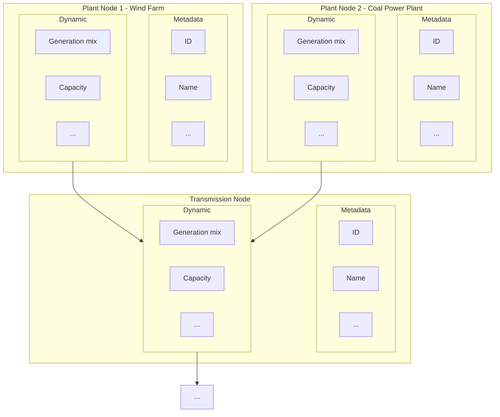

# Power system topology

We envision that any electric power grid can be described as a directed graph where nodes are different components of the power system elements and edges are connections between them.

To describe a power system topology we therefore need to enumerate the possible nodes, and edges, as well as their definitions.

## Granularity Levels

We might not want to strictly define specific named levels in the hierarchy, since each grid might be structured slightly differently. There can be a different number of levels for each region, but we should make sure that equivalent structures in each region use the same level numbers (this may mean that in some regions, certain levels are skipped).

|Level|US Grid|European Grid|Other Region 1|Definition|
|--|--|--|--|--|
|0|Interconnect| | | |
|1|Balancing Area| | | |
|2|Trading Hub / Transmission-congested zone| | | |
|3|Transmission Node/Substation| | | |
|4|Distribution Node/Substation or Power Plant| | | |
|5|Meter (Generator or Load)| | | |

## Graph Edges

|Level or Inter-level|Description|Type|Data|Other|
|--|--|--|--|--|
|0|Between Interconnects|Physical: DC transmission lines|Line capacity, etc| |
|0-1|Balancing Area to Interconnect Mapping|Virtual|Mapping table| |
|1|Between Balancing Areas|Physical: Transmission lines | | |
|1-2|Hubs to BAs|Virtual|Mapping table| |
|2|Between Trading Hubs / Transmission-congested zones|Physical: Transmission lines | | |
|2-3|Transmission Substation to Hub|Virtual|Mapping table| |
|3|Between Transmission Nodes/Substation|Physical: Transmission lines | | |
|3-4|Distribution Substations/Plants to Transmission Nodes|Physical: subtransmission lines|| |
|4|Between Distribution Node/Substation or Power Plant|N/A? | | |
|4-5|Meters to substations/plants|Physical: distribution lines|| |
|5|Between Meters (Generator or Load)|N/A?| | |
